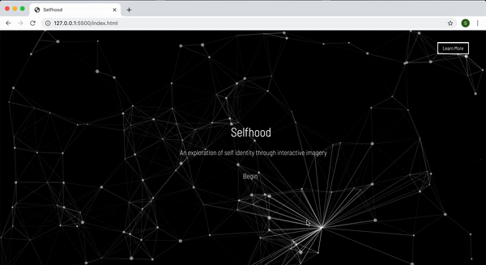
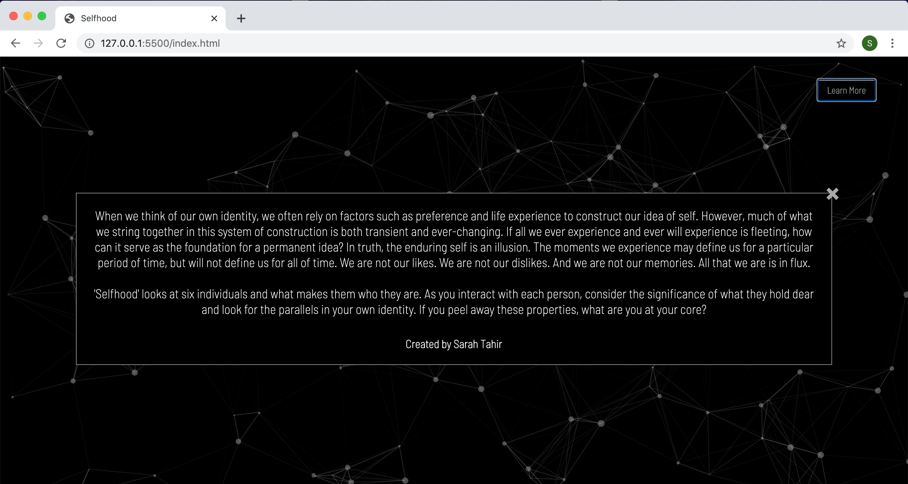
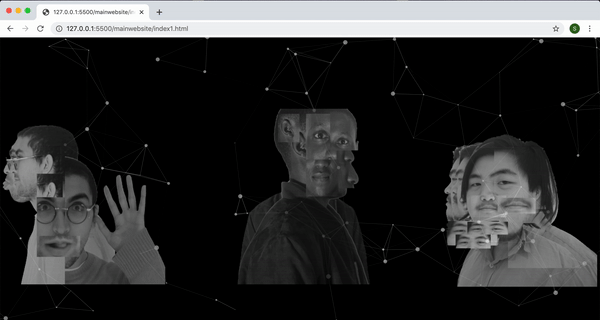
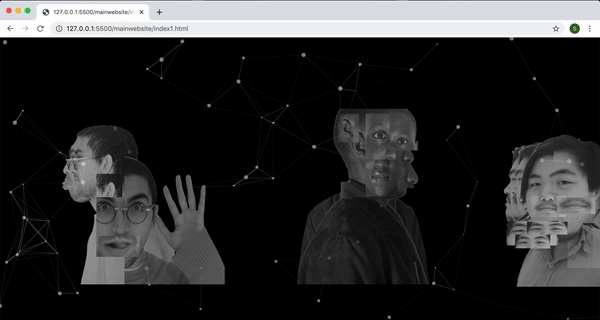

# Selfhood
#### Internet based art project that explores the idea of self based on David Hume's Bundle Theory.
__Created and Programmed by Sarah Tahir__

When we think of our own identity, we often rely on factors such as preference and life experience to construct our idea of self. However, much of what we string together in this system of construction is both transient and ever-changing. If all we ever experience and ever will experience is fleeting, how can it serve as the foundation for a permanent idea? In truth, the enduring self is an illusion. The moments we experience may define us for a particular period of time, but will not define us for all of time. We are not our likes. We are not our dislikes. And we are not our memories. All that we are is in flux. 

'Selfhood' looks at six individuals and what makes them who they are. As you interact with each person, consider the significance of what they hold dear and look for the parallels in your own identity. If you peel away these properties, what are you at your core?

Open index.html within the website folder to view the website.

